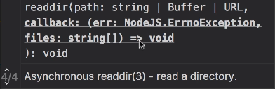
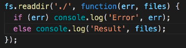
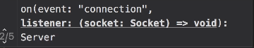

# JS Engines

### 1.Firefox => Spidermonkey

### 2.Chrome => V8

# How Node Works

Node is **single-threaded**. It has **Non-blocking/Asynchronous** architecture.

## Handling requests in Async

when a request arrives, the thread handles the request. if we have to query the database, the thread doesn't wait for the response. when the database prepares the response it puts a message in the ***Event Queue*** . Node is constantly monitoring this.

# Template String

In ES6 / ES2015 we have a feature called template string which helps us build a string without concatenation.

### we use ` instead of "

for example if we want a console log of a string with a value added we use the following syntax:
`console.log(Total Memory: ${totalMemory});`

# File System Module

### Almost every method in the File System Module comes in 2 forms:

1.  Async
2.  Sync

Even though we have synchronous methods we should avoid using them. These are there for simplicity. In a real world app we should use async methods.

# Callback Functions

All async methods take a function as their last arg. Node will call this function when that async operation completes. We call this function a **callback**.



Intellisense shows that the callback function for `fs.readdir()` function has two parameters. an error or the result.
We need to check if we have an error or the result.
***Note: The important thing to know is, only one of the two parameters will have a value and the other will be null.***



The example in the picture above is just to show the basic syntax.

# Event Module

A lot of Nodes' core functionality is based on this concept of events.

## What is an event

It is a **signal** that indicates something has happened.

### The [Docs](https://nodejs.dev/en/api/v18/events/) for Event module starts off explaining:

Much of the Node.js core API is built around an idiomatic asynchronous event-driven architecture in which certain kinds of objects (called "emitters") emit named events that cause Function objects ("listeners") to be called.

All objects that emit events are instances of the `EventEmitter` class. These objects expose an `eventEmitter.on()` function that allows one or more functions to be attached to named events emitted by the object. Typically, event names are camel-cased strings but any valid JavaScript property key can be used.

When the EventEmitter object emits an event, all of the functions attached to that specific event are called ***synchronously***. Any values returned by the called listeners are ignored and discarded.

# Event Emitter Class

Is one of the core building blocks of node and alot of classes are based on it.

### To use it we must create an object of it:

```javascript
const EventEmitter = require('events');
const emitter = new EventEmitter();
```

## Using EventEmitter

An EventEmitter object has a lot of methods but we mostly use two of them.

### `emitter.emit()`

We use this method to raise an event. We're signalling that an event has happened.
The first argument in this method is the name of the event.
We can pass an object that holds the data we need to this function. Then when the event is raised the object is passed as the argument to the listener function.

### Registering a Listener

***Every event needs a listener***
A listener is a function that will be called when that event is raised.
There are two methods to that register a listener:

- `emitter.on()`
- `emitter.addListener()`
    They are exactly the same but we use the `emitter.on()` method.
    These methods take two arguments.
    1.The name of the event
    2.The callback function for when the event is raised

```javascript
const EventEmitter = require('events');
const emitter = new EventEmitter();

// Register a listener
emitter.on('messageLogged', function(arg){
    console.log('event called.', arg);
});

// Raise an event
emitter.emit('messageLogged', {id: 1, url: ''});
```

When calling the `emit()` function, it iterates over all registered listeners and calls them ***synchronously***.

## Using the Arrow function

When registering the listener we use the following syntax:

```javascript
emitter.on('messageLogged', function(arg){
    console.log('event called.', arg);
});
```

instead of using the `function` keyword, we can omit that and use the arrow function as shown below:

```javascript
emitter.on('messageLogged', (arg) => {
    console.log('event called.', arg);
});
```

# Practically using EventEmitter

## The problem

The problem with using Event emitter in the fashion explained above is that we will face a problem when wanting to raise an event from another module in a different file.
The `emitter.emit()` in our module file is a different object than the the `emitter` object made in the app.js file where the listener is registered.
So to solve this, we must create a class for the function we want to implement and extend the `EventEmitter` class to it. That way when creating an object of our class we have access to all the functionality of`EventEmitter` class. Thus we can create an object and register a listener without problem.

## Example Codes for a Logger Class

### Logger.js

```javascript
const EventEmitter = require('events');
// const emitter = new EventEmitter();

const url = 'logger.io';

class Logger extends EventEmitter{
    log(message){
        // console.log(message);
        this.emit('logging', {data: message});
    }
}

module.exports = Logger;
```

### app.js

```javascript
const Logger = require('./logger');
const log = new Logger();

log.on('logging', (arg) => {
    console.log(`message: ${arg.data}`);
});

log.log('message from log event');
```

# HTTP Module

We use this module to create networks in applications.
We can create a web server that listens for HTTP requests on a given port. Using this we can easily create a back-end service.

# Working With HTTP

## Responding to a 'connection' event

1.  First we must load the module.
    `const http = require('http');`
    
2.  Then we can use the `createServer()`method to make a server and store it in an object.
    `const server = http.createServer();`
    This server is an ***Event Emitter*** so we can use all the methods of and `EventEmitter` Class.
    
3.  Then we must register a listener to listen on a specific port.
    

```
server.on('connection', (socket) => {
        console.log('new conection...')
});
```

The arguments in this listener are predefined and are in the document.



As show above this listener has "connection" as the name of the event and receives a socket object as arg.

4.  Then we raise an event using:
    `server.listern(3000);`

This method is very low level and is not commonly used.

## A more common approach

We can use a callback function when creating the server:

```javascript
server = http.createServer( (req,res) => {
    if(req.url === '/'){
        res.write('Hello World');
        res.end();
    }
    if(req.url === '/course'){
        res.write( JSON.stringify( [1, 2, 3] ) );
        res.end();
    }
    
} );

```

Then we can remove the `.on()` function.

***Note:*** Though this approach is perfectly fine, it's not ideal for building a complex application. Because in a large application we have various end-points and that means we will have a lot of if statements.