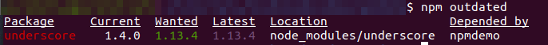
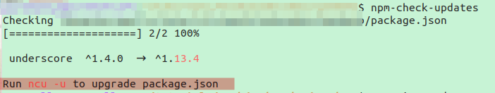
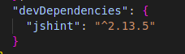

# What Is Node Package Manager

it is a command-line tool and a registry of 3rd party libraries that we can add to our node applications.

## package.json

It is basically a json file that includes some basic info about your application or project. It includes data such as:

- name
- version
- authors
- git repo address
- dependency
    It is metadata about your application
    ***All node apps have this file***, so before adding any packages added to our project we must have this file.

### Creating package.json

1.  To create this file we run:
    `npm init`
    in our project directory.
2.  To create a package.json file with all the default values we run:
    `npm init --yes`

# Installing Node Packages

We run:
`npm install <package name>` or `npm i ,`

***A good place to find and see how packages work is [the npmjs site](https://www.npmjs.com/).***
When in stalling a package for our project, that package is added to our dependency list in package.json

# Using A Package

In order to work with an installed package we use the `require` function:
`let _ = require('underscore');`
When supplying a module, the `require()` function:

1.  assumes that it is a core module.
2.  If not, assumes it is a file or a folder in the project. To reference a file or a folder, we have to use `./<filename>`. If we have, then the `require()` function will assume that either there is a `<filename>.js` file in the project folder, or `./<filename>/index.js`.
3.  If non of the above, assumes that this module is inside the **node_modules** folder.

# Copying source code and Git usage

***When checking our source code into a source control repository or copying from a machine to another, we do not include node_modules folder***
Our dependency list is stored in our package.json file. We can restore dependencies using npm from package.json using:
`npm i`
npm will automatically install all the dependencies listed in package.json.

## Adding node_modules to .gitignore

we create a `.gitignore` file and simply add `node_modules/` to it. the / indicates that it is a folder.

# Listing Installed Packages

To see a list of all the installed dependencies and their exact version:
`npm list`
We will see a list of all the dependencies and their dependencies.
To only see the dependencies we installed and not their individual dependencies:
`npm list --depth=0`

## Metadata about a library

This shows the package.json file for the given package:
`npm view <packagename>`
We can also add any property in the package.json file as a parameter to check it individually. ex:
`npm view mongoose dependencies`

## Installing a specific version of a package

***To find out more about versions check out [Semantic versioning](../../Node.js/02.NPM/Semantic%20versioning.md)***

First we can find a list of all available versions of the desired package:
`npm view <package> versions`
Then we install the desired version using:
`npm i <package>@<version>`

# Updating Local Packages

To find out what packages have been updated to a newer version:
`npm outdated`
If there are any outdated packages the result will look like this:

## Note on `npm outdated`

The `outdated` command will show outdated packages based on minor and patch releases. This means that if for example you have the underscore package and in your package.json you have the version "^1.4.0", when you run this command it will show the latest minor and patch release as outdated and not the major version. As you see in the screenshot above, the wanted version of underscore is "1.13.4" but there is also a Latest column. If there is a newer major version available for this package it will show up in this column.

## Updating the outdated packages

To update the outdated packages we simply run:
`npm update`
This updates all outdated packages to the latest minor version.

### Updating to a major package

To update dependencies to a major update, we need to install an npm tool *(Run this command as super user / sudo)*:
`npm i -g npm-check-updates`
Now `npm-check-updates` is installed.

The command `ncu -u` upgrades our package.json. Now after package.json is updated, running `npm install` automatically installs all dependencies listed in package.json.

# DevDependencies

The dependencies discussed so far were application dependencies, like mongoose. Our application needs these dependencies to function properly.
Sometimes we use dependencies that are only used during development. Like tools used for:

- Running unit tests
- Doing static analysis on our code
- Bundling our JS code
    These dependencies are ***Development Dependencies*** and should not go in the production environment, where we deploy our application.

## Installing DevDependencies

In order to specify that the package we are installing is a development dependency, we supply a flag:
`npm i <package> --save-dev`
In our package.json file, after installing a devDependency, it is listed under devDependencies:

*(after installing the jshint package)*

# Uninstalling Packages

To remove packages we use:
`npm un <package>`
This removes he package and is removes from the dependency list in package.json.

# Global Packages

There are node packages that are not specific to an application. These are often command-line tools that we want to access from a everywhere.
an example of such packages is `npm`.
To install a node package globally, we use the `-g` flag. All node commands so far will also work with global packages. for example if we want to see a list of all te outdated global packages we run the command:
`npm -g outdated`