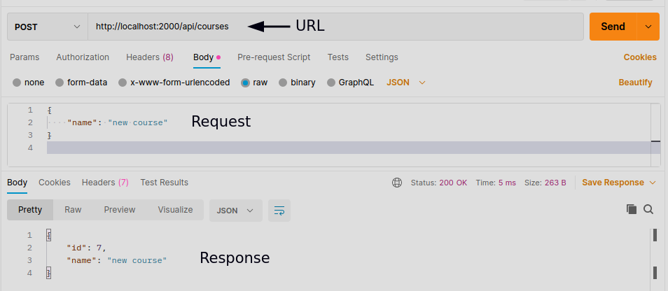

# Handling GET Requests

In order to handle GET requests we must check if the request wants a list or one resource:

```javascript
// Defining Test database to read souorces from
const courses = [
  {id: 1 , name: "course1"},
  {id: 2 , name: "course2"},
  {id: 3 , name: "course3"},
];
app.get('/api/courses', (req, res) => {
  res.send(courses);
});

app.get('/api/courses/:id', (req, res) => {
  let course = courses.find(c => c.id === parseInt(req.params.id));
  
  if(!course){
    res.status(404).send("Course not found!");
  }
    
  res.send(course);
});
```

In the code above `find` is a global array variable that we pass a function as an argument to implement our logic in order to read the course id.
`req.params.id` returns a string so we need to use the global method `parseInt`.

If we don't have an id we simply send the whole array as a json file.
If we do we check for the id in the array. We create a variable that is going to hold the requested id so we can use validation techniques on that variable.

1.  If the id doesn't exist, we use `res.status()` to send back an HTTP status code and we can also use `res.send()` After that to send the user a message.
2.  If the id did exist, we simply send the array index that was requested.

# Handling POST Requests

In a POST request we need to:

1.  Read the resource object that should be in the body of the request.
2.  Use its properties to create a new resource object.
3.  Add that resource object to the database(a resource array here)

```javascript
app.use(express.json()); // Enables parsing of json objects in the body of a request

app.post('/api/courses', (req, res) => {
  const course = {
    id: courses.length + 1,
    name: req.body.name // Reading the name value in the body of the request
  };
  courses.push(course);
  res.send(course);
});
```

Here we are posting to a collection of resources hence the name 'courses'. We first create a course object and set its values depending on the object and model. This course object is going to be added to our database.
Then we read the body of the request. We assume that in the request body we have an object and that object has a name property.
`req.body.name` returns a json object so we need to enable parsing of json objects. This is not enabled by default so we use `app.use(express.json())` to enable it.
`courses` is an array in our codes so we use the push method to add the object to our array.
Finally when posting an object to the server, by convention, we return that object in the body of the response. The reason to this is because we are assigning the id to the object in the server and we need the client side to know the assigned id to the object.

## Testing an endpoint in postman

In order to test our endpoint we use the Postman app to send a post request:



## Input validation

We should ***Never*** trust what the client sends us. In our example, since we're dealing with a simple object we validate our request like this:

```javascript
if(!req.body.name || req.body.name.length < 3)// If the name property doesnt exist or is less than 3 letters
    {
        res.status(400).send("Name is required and should be minimum 3 chars");// Error 400, Bad Request
        return; // Returnin to stop the rest of the function from executing
    }
```

### Schemas and Joi

our example is simple. In a real world application we will work with complex objects. We can use a node package called `joi` in npm.
`npm i joi`
Now in our code:
`const Joi = require('joi');`
`Joi` is a class that we use different properties and objects from to define schemas.
A ***Schema*** defines the shape of our objects.

```javascript
const schema = {
    name: Joi.string().min(3).required()
};
```

after defining the schema we need to validate the request based on the schema:

```javascript
const result = Joi.validate(req.body, schema);
if (result.error){
    res.status(400).send(result.error.details[0].message);//Bad request
    return;
}
```

***Note***: The Joi syntax used here is for an older version of joi and the function `validate` no longer exists. I haven't checked out the newer versions but when I do, I will update the documents.

# Handling PUT Requests
 In a PUT request, we are dealing with a single resource. To handle such request we need to:
 1. Look up the resource requested and check if it exists
 2. validate the resource
 3. update the resource and return it to the client

```javascript
app.put('/api/courses/:id', (req, res) => {
  // Checking if the course exists
  let course = courses.find(c => c.id === parseInt(req.params.id));
  
  if(!course){
    res.status(404).send("Course not found!");
    return;
  }

  // Validation
  const schema = {
    name: Joi.string().min(3).required()
  };
  const result = Joi.validate(req.body, schema);
  if(result.error){
    res.status(400).send(result.error.details[0].message);
    return;
  }

  // Updating the resource
  course.name = req.body.name;
  res.send(course);
});
```

When defining multiple endpoints, in order to keep the code clean and not copy codes, it's best to define our schema in a function and call that function every time we need to validate requests.

```javascript
function validateCourse(course){
  const schema = {
    name: Joi.string().min(3).required()
  };
  return Joi.validate(course, schema);
};
```

Then we use this function whenever we need to validate something and we pass `req.body` as an argument:

```javascript
const { error } = validateCourse(req.body); // result.error
  if(error){
    res.status(400).send(result.error.details[0].message);
    return;
  }
```
 ## Destructuring in modern javascript
 It is a Js feature that is used to access the properties of an object or collections of data and only store those instead of the whole collection. for more info check out [this](https://developer.mozilla.org/en-US/docs/Web/JavaScript/Reference/Operators/Destructuring_assignment) link. 
 So in our example, when reading the result from the `validate()` function in Joi instead of saving the whole object which has multiple properties we only save the properties which we are interested in. Here we only want the error value from the object. so we use the following syntax:
 `const { error } = ...`
 
***Example***
```javascript
const obj = { a: 1, b: 2 };
const { a, b } = obj;
// is equivalent to:
// const a = obj.a;
// const b = obj.b;
```

# Handling DELETE Requests
The DELETE request is very similar to the previous methods we have handled. In a DELETE request we need to: 
1. Look up the resource with id and check if it exists
2. Delete it
3. Return the same resource

```javascript
app.delete('/api/courses/:id', (req, res) => {
  // Checking if the course exists
  const course =  courses.find(c => c.id === parseInt(req.params.id))
  
  if (!course){
    res.status(404).send('course not found!');
    return; 
  }

  // Deleting the course
  const index = courses.indexOf(course);
  // Go to the index and reove 1 object
  courses.splice(index, 1);

  res.send(course);
});
```

We use the `splice()` array function to remove 1 object from the given index in the array.