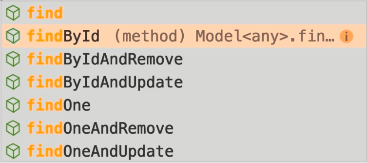
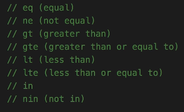
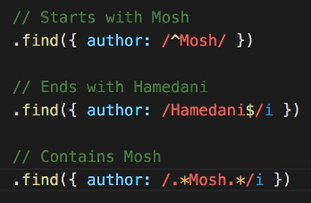

# Mongoose

## Schema

A mongoose schema can have the following types:

- String
- Number
- Date: We can `{ type: Date, default: Date.now }`
- Buffer: we use to store binary data
- Boolean
- ObjecyID: Unique identifiers
- Array

We create a schema like this:

```js
const courseSchema = new mongoose.schema({
    name: String,
    author: String,
    tags: [ String ],
    date: {type: Date, default: Date.now },
    published: Boolean
});
```

## Models

A model is like a class that we create instances of.
To create a model, we compile a schema into a model with `model()`:

`const Schema = mongoose.model('Model', modelSchema);`

The first arg is the name of the collection we want to make in singular format. We use Pascal case formatting. the second arg is the name of the schema we have created. so for the courseSchema we create a model like this:

`const Course = mongoose.model('Course', courseSchema);`

And we create an instance of a model like an object:

```js
const obj = new Model({
    key: value,
    key: value
});
```

We can omit the keys that have a default value in the schema definition.

## Querying documents

A model has multiple functions to query its documents:



## Comparison operators

In order to create complicated queries in mongodb, we can use comparison operators like this:



```js
const courses = await Course
        // .find({published: true})// filter based on only the pubished
        // .find({ price: {$gt: 10} })// documents with price greater than 10
        .find({price: { $in: [10, 15] }})// documents with prices of only 10 and 15
        .limit(10) // limit to 10 documents only
        .sort({ price: 1 }) // sort by key values in given object. 1 ascending and -1 descending order
        .select({name: 1, tags: 1, price: 1}); // selecting which attributes to show
```

We can also use the `count()` method instead of `select()` to just get the number of the documents instead of showing them all.

## Logical operators

For logical operators we use the `or()` and the `and()` operator and we pass an array which holds the filters:

```js
const models = await Model
    .find()
    .or([ {}, {} ])
    .and([ {}, {} ])

```

## Regular Expressions

We can use regular expressions in js to have a wider range of string reading:



## Pagination

A method that is used hand in hand with `limit()` is the `skip()` method. We can have a page number and a a page size. In order to go to a specific page and jump over other documents:

```js
const pageNum;
const pageSize;

const models = await Model
    .find()
    .skip( (pageNum - 1) * pageSize )
    .limit( pageSize )
```

***Note***: keep in mind that page number starts from 1.

## Updating mongoDB Documents

We can approach the process of updating documents in 2 ways:

### 1\. Query first

Here first we find the requested document, modify its contents and then save the document:

```js
async function updateQueryFirst(id){
    const course = await Course.findById(id)
    if(!course) return; // Checking if the course exists
    
    course.set({ // Using the set method to change the contents of the document
        published: false,
        author: "new author",
        price: 20,
        name: 'mazAgain'
    });
    
    const result = await course.save() // Using the save method to save the document
    console.log(course);    
}
```

### 2\. Update first

Here we first update the documents and then we can get the updated documents as well.
We use [mongoDB update operators](https://www.mongodb.com/docs/manual/reference/operator/update/#fields) to update our documents.

```js
async function updateFirst(id){
    const result = await Course.updateOne({ _id: id }, {
        $set: {
            author: 'mosh',
            published: false,
            name: 'update first'
        }
    });
}
```

the `update()` method receives a query object as the first argument. it can be a specific id or something more generic like the published key in our example schema. This would update all the courses that are published.
With the `update()` method we can update documents directly in our database. so we just store the result to be able to log it.
Sometimes we want to get the document that was updated. To do that we use the `findByIdAndUpdate()`. This method find s a specific course. But the key here is that if we do not pass the query obj with the `new` key set to true it shows the object prior to changing. but with the `new` tag the updated object will be shown.

## Removing MongoDB Documents

To remove documents we can use the `deleteOne()` and `deleteMany()` methods. These methods take a query object and delete one or many documents based on that. They return the result of the operation. To get the deleted documents, we can also use the `findByIdAndDelete()` method.

```js
const result = await Course.deleteMany({ price: null });
// OR
const couyrse = await Course.findByIdAndDelete(id);
```